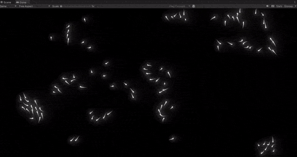

# SimpleUnityBoids

This project implements a basic "boid" simulation in Unity, inspired by Craig Reynolds' paper on flocking behavior.

## Boids Explained

"Boid" is a shorthand term for "bird-oid object," an agent created by Craig Reynolds that follows three core rules to simulate realistic flocking behavior:

1. **Separation:** Boids avoid overcrowding by steering away from their immediate neighbors.
2. **Alignment:** Boids tend to match the direction of nearby boids, fostering a sense of cohesion within the flock.
3. **Cohesion:** Boids are drawn towards the average position of their neighbors, promoting flocking togetherness.

These simple rules, when combined, generate emergent flocking behavior that appears complex and natural.

Also, if you hold down your left mouse button, they avoid you :).
